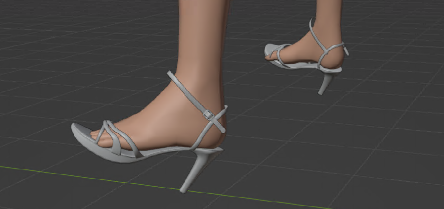

[English](#english) | [简体中文](#%E7%AE%80%E4%BD%93%E4%B8%AD%E6%96%87)

# English
# COM3D2.HighHeel-InoryS


This is a high-heel plugin that dynamically adjusts the positions of feet and toes to achieve high-heel effects.

I guess I am the one maintaining it now.

## How to Use

If you are using someone else's shoes

### Install the Plugin

Download the plugin.

Place `COM3D2.HighHeel.Plugin` in the folder `COM3D2\BepInEx\Plugin\` or `COM3D2\BepInEx\plugins\COM3D2.HighHeel\`.

### Configuration Files
Place configuration files in `COM3D2\BepInEx\config\COM3D2.HighHeel\`.

`GlobalBodyOffset.json` is a global offset configuration file (adjusting ground clearance).

The folder `COM3D2\BepInEx\config\COM3D2.HighHeel\Configurations\` contains shoe configuration files. All configuration files should start with `hhmod_`.

If the author provided you with a file named `hhmod_xxxx.json`, you should place it here.

When the object's name (mesh name) of the shoes includes `hhmod_foobar`, the plugin reads the corresponding `hhmod_foobar.json` from the shoe configuration folder.

If you modify the configuration file, you can click "reload" in the plugin settings to reload the configuration files.


## Detailed Explanation of Configuration Files

The configuration file is located in `COM3D2\BepInEx\config\COM3D2.HighHeel\`

### Configuration.cfg
This is an example configuration:

```
## Configuration file created by COM3D2.HighHeel v1.0.9.0
## Plugin GUID: com.inorys.com3d2.highheel

[Config]

## Whether the plugin is enabled
# Setting type: Boolean
# Default value: true
Enabled = true

## Shortcut key to show GUI
# Setting type: KeyboardShortcut
# Default value: F9 + LeftControl
UIShortcut = F9 + LeftControl

## Whether to add a gear menu button
# Setting type: Boolean
# Default value: true
AddGearMenuButton = true

## If true, enables global offset settings; otherwise, uses individual offset settings for each shoe
# Setting type: Boolean
# Default value: true
EnableGlobalPreSceneOffsetSettings = true

## If true, applies offset for men; otherwise, no offset is applied to men. This is for aligning men with maids in yotogi scenes (offset adjusts ground clearance).
# Setting type: Boolean
# Default value: true
UseManOffset = true
```
### GlobalBodyOffset.json
If `EnableGlobalPreSceneOffsetSettings` in `Configuration.cfg` is set to true, this file's offset settings are used.

Offsets adjust ground clearance: the higher the value, the farther the character is from the ground.

Here is an example configuration (you cannot leave comments in the actual file):
```
{
	"DefaultBodyOffset": 0.04, //Default maid BodyOffset, if you do not set BodyOffset for the scene separately, this value is applied.
	"DefaultManBodyOffset": 0.0, //Default man BodyOffset, if you do not set BodyOffset for the scene separately, this value is applied.
	"PerSceneBodyOffsets": {
		"SceneDaily": 0.02, //Maid BodyOffset set separately for each scene, which means that the maid BodyOffset of the scene named SceneDaily is set to 0.02.
		"SceneTrophy": 0.14, //Maid BodyOffset set separately for each scene, which means that the maid BodyOffset of the scene named SceneTrophy is set to 0.14.
		"SceneYotogi": 0.04,
		"SceneFreeModeSelect": 0.14,
		"SceneYotogiOld": 0.05,
		"SceneDance_CKTCK_Release": 0.06,
		"SceneDance_CPM_K_2_Release": 0.06,
		"SceneDance_1OY_K_Release": 0.06
	},
	"PerSceneManBodyOffsets": {
		"SceneDaily": 0.02, //The man BodyOffset is set separately for each scene, which means that the man BodyOffset of the scene named SceneDaily is set to 0.02.
		"SceneTrophy": 0.06, //The man BodyOffset is set separately for each scene, which means that the man BodyOffset of the scene named SceneTrophy is set to 0.02.
		"SceneYotogi": 0.0,
		"SceneFreeModeSelect": 0.05,
		"SceneYotogiOld": 0.05
	}
}
```


| Scene Name | Description |
| ----------- | ----------- |
| SceneTrophy | Yotogi scene in CBL version|
| SceneYotogi | Standard Yotogi scene |
| SceneYotogiOld | Old Yotogi scene |
| SceneDance_CKTCK_Release | CKTCK Karaoke |


To find the current scene's index or name, you can install [COM3D2.DebugLilly.BepInExPlugin.dll](https://github.com/customordermaid3d2/COM3D2.Lilly.BepInExPlugin/releases). This plugin displays the current scene's index and name in the console, as well as a list of all available scenes.

<details>
<summary>All Scene List in COM3D2 2.40.0</summary>

| Scene Index|   Scene Name               |
|-----|-----------------------------------|
| 0   | _cm3d21                           |
| 1   | SceneCharacterSelect              |
| 2   | SceneCompetitiveShow              |
| 3   | SceneDaily                        |
| 4   | SceneDance_DDFL_Release           |
| 5   | SceneEdit                         |
| 6   | SceneLogo                         |
| 7   | SceneMaidManagement               |
| 8   | SceneShop                         |
| 9   | SceneTitle                        |
| 10  | SceneTrophy                       |
| 11  | SceneTryInfo                      |
| 12  | SceneUserEdit                     |
| 13  | SceneWarning                      |
| 14  | SceneYotogi                       |
| 15  | SceneADV                          |
| 16  | SceneStartDaily                   |
| 17  | SceneToTitle                      |
| 18  | SceneSingleEffect                 |
| 19  | SceneStaffRoll                    |
| 20  | SceneDance_ETYL_Release           |
| 21  | SceneDanceSelect                  |
| 22  | SceneDance_SCL_Release            |
| 23  | SceneDeskCustomize                |
| 24  | SceneFreeModeSelect               |
| 25  | SceneMaidBattle                   |
| 26  | ScenePhotoMode                    |
| 27  | SceneDance_RTY_Release            |
| 28  | SceneEmpireLeague                 |
| 29  | SceneDance_KNT_Release            |
| 30  | SceneVRTouch                      |
| 31  | SceneDance_SSNK_Release           |
| 32  | AddSceneVRMiniGameAirPlane        |
| 33  | AddSceneVRMiniGameDarts           |
| 34  | AddSceneVRMiniGameWanage          |
| 35  | AddSceneVRMediaPlay               |
| 36  | SceneVRCommunication              |
| 37  | SceneDance_NMF_Release            |
| 38  | SceneDance_BLD_Release            |
| 39  | SceneDance_KAD_Release            |
| 40  | SceneFacilityManagement           |
| 41  | SceneFacilityPowerUp              |
| 42  | SceneScenarioSelect               |
| 43  | SceneDance_BLDT_Release           |
| 44  | SceneDance_KADT_Release           |
| 45  | SceneDance_NMFT_Release           |
| 46  | SceneBenchMarkSetting             |
| 47  | SceneCasino                       |
| 48  | SceneBlackJack                    |
| 49  | SceneCasinoSlot                   |
| 50  | SceneDance_LUM_Release            |
| 51  | SceneCasinoShop                   |
| 52  | SceneCreativeRoom                 |
| 53  | SceneKasizukiMainMenu             |
| 54  | SceneNetorareCheck                |
| 55  | SceneDance_MOE_Release            |
| 56  | SceneDance_SCLT_Release           |
| 57  | SceneDance_KNTT_Release           |
| 58  | SceneDance_MOE2_Release           |
| 59  | SceneDance_DDFLT_Release          |
| 60  | SceneDance_RTYT_Release           |
| 61  | SceneDance_MOET_Release           |
| 62  | SceneDance_LUMT_Release           |
| 63  | SceneYotogiOld                    |
| 64  | SceneDance_ETY21T_Release         |
| 65  | SceneDance_CKTCK_Release          |
| 66  | SceneDance_DDFLK_Release          |
| 67  | SceneDance_HHSK_Release           |
| 68  | SceneDance_RTYK_Release           |
| 69  | SceneDance_SCLK_Release           |
| 70  | SceneDance_SMTK_Release           |
| 71  | SceneDance_SUH_Release            |
| 72  | SceneDance_SUHT_Release           |
| 73  | SceneDance_BLDK_Release           |
| 74  | SceneDance_KADK_Release           |
| 75  | SceneDance_NMFK_Release           |
| 76  | SceneDance_MAP_Release            |
| 77  | SceneDance_MAPT_Release           |
| 78  | SceneDance_LUM_K_Release          |
| 79  | SceneDance_SUHK_Release           |
| 80  | SceneDance_MOEK_Release           |
| 81  | SceneEmpireLifeMode               |
| 82  | SceneDance_SDB_Release            |
| 83  | SceneDance_SDBT_Release           |
| 84  | SceneDance_FUA_P_Release          |
| 85  | SceneNPCEdit                      |
| 86  | SceneDance_1OY_Release            |
| 87  | SceneDance_1OYT_Release           |
| 88  | SceneDance_CGL_Release            |
| 89  | SceneDance_CGLT_Release           |
| 90  | SceneDance_NMFEnglish_Release     |
| 91  | SceneDance_NMFTEnglish_Release    |
| 92  | SceneDance_TYP_Release            |
| 93  | SceneDance_TYPT_Release           |
| 94  | ScenePrivate                      |
| 95  | ScenePrivateEventMode             |
| 96  | SceneDance_RTD_Release            |
| 97  | SceneDance_RTDS_Release           |
| 98  | SceneDance_RTDT_Release           |
| 99  | SceneDance_LOC_P_Release          |
| 100 | SceneDance_AIKS_K21_Release       |
| 101 | SceneDance_DGP_Release            |
| 102 | SceneDance_DGPT_Release           |
| 103 | SceneDance_SMT_L21_Release        |
| 104 | SceneDance_SMT_T21_Release        |
| 105 | SceneDance_HHSx4_T21_Release      |
| 106 | SceneDance_HHSx4_L21_Release      |
| 107 | SceneDance_REG_L21_Release        |
| 108 | SceneDance_REG_T21_Release        |
| 109 | SceneDance_SSEx3_L21_Release      |
| 110 | SceneDance_SSEx3_T21_Release      |
| 111 | SceneDance_RTD_K_Release          |
| 112 | SceneDance_SDB_K_Release          |
| 113 | SceneDance_DGPK_Release           |
| 114 | SceneScout                        |
| 115 | SceneDance_REG_K_Release          |
| 116 | SceneDance_1OY_K_Release          |
| 117 | SceneDance_MAP_K_2_Release        |
| 118 | SceneDance_SUM_L21_Release        |
| 119 | SceneDance_SUM_T21_Release        |
| 120 | SceneDance_AIKS_2_K21_Release     |
| 121 | SceneDance_KHG_T21_Release        |
| 122 | SceneDance_KHG_L21_Release        |
| 123 | SceneDance_SFD_L21_Release        |
| 124 | SceneDance_SFD_T21_Release        |
| 125 | SceneDance_MTD_3_E21_Release      |
| 126 | SceneDance_MTD_1_E21_Release      |
| 127 | SceneDance_CIL_Release            |
| 128 | SceneDance_CILT_Release           |
| 129 | SceneShooting                     |
| 130 | SceneDance_RUB_Release            |
| 131 | SceneDance_RUBT_Release           |
| 132 | SceneDance_CIL_K_Release          |
| 133 | SceneDance_RUB_K_Release          |
| 134 | SceneDance_NMF_K_boku_2_Release   |
| 135 | SceneDance_NMF_K_dos_2_Release    |
| 136 | SceneDance_NMF_K_majime_2_Release |
| 137 | SceneDance_NMF_K_muku_1_Release   |
| 138 | SceneDance_NMF_K_muku_2_Release   |
| 139 | SceneDance_NMF_K_rin_2_Release    |
| 140 | SceneDance_NMF_K_boku_4_Release   |
| 141 | SceneDance_NMF_K_dos_4_Release    |
| 142 | SceneDance_NMF_K_muku_3_Release   |
| 143 | SceneDance_NMF_K_muku_4_Release   |
| 144 | SceneDance_NMF_K_majime_4_Release |
| 145 | SceneDance_NMF_K_rin_4_Release    |
| 146 | SceneDance_CPM_K_2_Release        |
| 147 | SceneDance_CPM_K_1_Release        |
| 148 | SceneHoneymoonMode                |
| 149 | SceneEyecatch                     |
| 150 | SceneFishingGame                  |
| 151 | SceneAssSumo                      |
| 152 | SceneAssSumoSecond                |
| 153 | SceneTeikokusouRevivalMode        |
| 154 | SceneTeikokusouPlayMode           |

</details>


### hhmod_foobar.json
`.json` files starting with `hhmod_` are shoe-specific configuration files. Predefined configuration files include:

 - hhmod_13d.json
 - hhmod_20d.json
 - hhmod_27d.json
 - hhmod_34d.json

Numbers like `13d`, `20d`, etc., refer to the angle (around the Z-axis) of the character's foot bones, which creates the high-heel effect.

For example:

 - 13d ~= 2-inch (50mm) heels
 - 20d ~= 3-inch (75mm) heels
 - 27d ~= 4-inch (100mm) heels
 - 34d ~= 5-inch (125mm) heels

An example configuration for `hhmod_27d.json`:
```
{
	"BodyOffset": 0.04, //Default maid BodyOffset, if you don't set BodyOffset for the scene separately, this value is applied. //If you set EnableGlobalPreSceneOffsetSettings to false in, this value is used, otherwise this value will not be used
	"ManBodyOffset": 0.0, //Default man BodyOffset, if you don't set BodyOffset for the scene separately, this value is applied. //If you set EnableGlobalPreSceneOffsetSettings to false in , use this value, otherwise this value will not be used
	"PerSceneBodyOffsets": { //If you set EnableGlobalPreSceneOffsetSettings to false in , use this value, otherwise this value will not be used
		"SceneDaily": 0.02, //Maid BodyOffset set separately for each scene, which means setting the maid BodyOffset of the scene named SceneDaily to 0.02
		"SceneTrophy": 0.14, //Maid BodyOffset set separately for each scene, which means setting the maid BodyOffset of the scene named SceneTrophy to 0.14
		"SceneYotogi": 0.04,
		"SceneFreeModeSelect": 0.14,
		"SceneYotogiOld": 0.05,
		"SceneDance_CKTCK_Release": 0.06,
		"SceneDance_CPM_K_2_Release": 0.06,
		"SceneDance_1OY_K_Release": 0.06
	},
	"PerSceneManBodyOffsets": { //If you set EnableGlobalPreSceneOffsetSettings to false in , use this value, otherwise this value will not be used
		"SceneDaily": 0.02, //The man BodyOffset set for each scene separately, which means setting the man BodyOffset of the scene named SceneDaily to 0.02
		"SceneTrophy": 0.06, //The man BodyOffset set for each scene separately, which means setting the man BodyOffset of the scene named SceneTrophy to 0.06
		"SceneYotogi": 0.0,
		"SceneFreeModeSelect": 0.05,
		"SceneYotogiOld": 0.05
	},
	"FootLAngle": 27.0, //Z of the left foot Axis rotation angle, because this is a 27d profile, it is set to 27
	"FootLMax": 88.0, // Maximum Z-axis rotation angle of the left foot
	"ToeL0AngleX": 7.0, // X-axis angle of the little toe of the left foot
	"ToeL0AngleY": -17.0, // Y-axis angle of the little toe of the left foot
	"ToeL0AngleZ": -17.0, // Z-axis angle of the little toe of the left foot
	"ToeL01AngleX": 5.0, // X-axis angle of the front end of the little toe of the left foot
	"ToeL01AngleY": 0.0, // Y-axis angle of the front end of the little toe of the left foot
	"ToeL01AngleZ": 0.0, // Z-axis angle of the front end of the little toe of the left foot
	"ToeL1AngleX": 0.0, // X-axis angle of the middle three toes of the left foot (this is because KISS Only one bone is assigned to them)
	"ToeL1AngleY": 0.0, //Y-axis angle of the middle three toes of the left foot
	"ToeL1AngleZ": -27.0, //Z-axis angle of the middle three toes of the left foot
	"ToeL11AngleX": 0.0, //X-axis angle of the front end of the middle three toes of the left foot (this is because KISS only assigns one bone to them)
	"ToeL11AngleY": 0.0, //Y-axis angle of the front end of the middle three toes of the left foot
	"ToeL11AngleZ": 0.0, //Z-axis angle of the front end of the middle three toes of the left foot
	"ToeL2AngleX": -2.0, //X-axis angle of the big toe of the left foot
	"ToeL2AngleY": 0.0, //Y-axis angle of the big toe of the left foot
	"ToeL2AngleZ": -17.0, //Z-axis angle of the big toe of the left foot Axis angle
	"ToeL21AngleX": 0.0, //The X-axis angle of the front of the big toe of the left foot
	"ToeL21AngleY": 0.0, //The Y-axis angle of the front of the big toe of the left foot
	"ToeL21AngleZ": -14.0, //The Z-axis angle of the front of the big toe of the left foot
	"FootRAngle": 27.0, //The Z-axis rotation angle of the right foot, because this is a 27d profile, it is set to 27
	"FootRMax": 88.0, //The maximum Z-axis rotation angle of the right foot
	"ToeR0AngleX": -7.0, //The X-axis angle of the little toe of the left foot
	"ToeR0AngleY": 17.0, //The Y-axis angle of the little toe of the left foot
	"ToeR0AngleZ": -17.0, //The Z-axis angle of the little toe of the left foot
	"ToeR01AngleX": 0.0, //The X-axis angle of the tip of the little toe of the left foot
	"ToeR01AngleY": 0.0, //The Y-axis angle of the tip of the little toe of the left foot
	"ToeR01AngleZ": 0.0, //The Z-axis angle of the tip of the little toe of the left foot
	"ToeR1AngleX": 0.0, //The X-axis angle of the three middle toes of the left foot (this is because KISS only assigns one bone to them)
	"ToeR1AngleY": 0.0, //The Y-axis angle of the three middle toes of the left foot
	"ToeR1AngleZ": -27.0, //The Z-axis angle of the three middle toes of the left foot
	"ToeR11AngleX": 0.0, //The X-axis angle of the tip of the three middle toes of the left foot (this is because KISS only assigns one bone to them)
	"ToeR11AngleY": 0.0, //The Y-axis angle of the tip of the three middle toes of the left foot
	"ToeR11AngleZ": 0.0, //Z-axis angle of the front of the middle three toes of the left foot
	"ToeR2AngleX": 2.0, //X-axis angle of the big toe of the left foot
	"ToeR2AngleY": 0.0, //Y-axis angle of the big toe of the left foot
	"ToeR2AngleZ": -17.0, //Z-axis angle of the big toe of the left foot
	"ToeR21AngleX": 0.0, //X-axis angle of the front of the big toe of the left foot
	"ToeR21AngleY": 0.0, //Y-axis angle of the front of the big toe of the left foot
	"ToeR21AngleZ": -14.0 //Z-axis angle of the front of the big toe of the left foot
}
}

```
If you have other entries in your configuration file, it is most likely migrated from an older version, and the latest version has removed some unused values ​​from the previous version to avoid confusion.

If your configuration file does not have an XYZ entry like this, it is the original version of the configuration file, which is not compatible, so you may see that the toe position is incorrect. You need to modify it to the new version configuration file.
```
"ToeL0AngleX": 6.0,
"ToeL0AngleY": -1.0,
"ToeL0AngleZ": -11.0,
```
You need to modify the value without the left mark in the previous version of the configuration file to the Z axis.
```
"ToeL0Angle": 7.0,
```
To
```
"ToeL0AngleZ": 7.0,
```


## How It Works and How to Create High Heels
The plugin reads the object name (mesh name) of the shoes being worn. You need to include `hhmod_foobar` in the name, which will be used to identify the corresponding configuration file.

The plugin also recognizes names like:

 - aaaa_hhmod_foobar_bbbb
 - hhmod_foobar_bbbb
 - aaaa_hhmod_foobar

All of these will be identified as `hhmod_foobar`.

When a shoe's object name contains `hhmod_foobar`, the plugin reads the configuration file hhmod_foobar.json and applies its settings.


```
Warning:
The identification method of versions 1.0.8.0 and earlier is different. 1.0.8.0 and all ongame versions (plugin guid is ongame) will read the 9 characters after hhmod_.

While habeebweeb 1.0.0 will read the complete string after hhmod_ including hhmod_.
```

The plugin allows you to configure the angle of foot rotation (Z-axis only) and separately control three axes for the toes, enabling adjustments like making them more compact or slightly rotated.

When creating shoes, you just need to match the shoe to the bottom of the character's foot.



You can import some mods to see how they do it.

If you have a situation where you are sinking into the ground, use offset, a positive offset will move it towards the positive Z axis (increase height off the ground).

### About GUI

Some options are not displayed on the GUI, please refer to the configuration file.

After modifying the configuration file, click reload in the GUI to take effect.


## Known MODs

@COM3D240959451
- https://ux.getuploader.com/kotone_com_1/

@WyvernAeon
- https://ux.getuploader.com/WyvernAEON/download/5
- https://ux.getuploader.com/WyvernAEON/download/3

@InorySSS
- https://mega.nz/folder/U6Jy0a6a#Pv5G9G_J5zoYc46TVmz6iA


<br>
<br>
<br>
<br>
<br>
<br>


# 简体中文

# COM3D2.HighHeel-InoryS

这是一个通过动态调整脚和脚趾的位置来实现高跟鞋的高跟鞋插件。

我猜现在由我维护了。

## 如何使用

如果您使用别人的鞋子

#### 安装插件

1. 下载插件
2. COM3D2.HighHeel.Plugin 放到 `COM3D2\BepInEx\Plugin\` 或 `COM3D2\BepInEx\plugins\COM3D2.HighHeel`

#### 配置文件

配置文件放到 `COM3D2\BepInEx\config\COM3D2.HighHeel\` 

GlobalBodyOffset.json 是一个全局 offset（调整离地高度） 的配置文件

`COM3D2\BepInEx\config\COM3D2.HighHeel\Configurations\` 里面是鞋子配置文件，所有配置文件应该以 `hhmod_` 开头。

如果作者给你了一个 `hhmod_xxxx.json` 那么你应该放到这里。

当鞋子的物体名（网格名）带有 hhmod_foobar 时，插件从鞋子配置文件夹中读取对应的 `hhmod_foobar.json`。

如果更改了配置文件，你可以在插件设置中单击 reload，这将重新加载配置文件。

## 配置文件详解

配置文件位于 `COM3D2\BepInEx\config\COM3D2.HighHeel\`

### Configuration.cfg

这是配置的示例：
```
## 设置文件由插件 COM3D2.HighHeel v1.0.9.0 创建
## 插件 GUID：com.inorys.com3d2.highheel

[Config]

## 插件是否启用
# 设置类型：布尔值
# 默认值：true
Enabled = true

## 显示 GUI 的快捷键
# 设置类型：KeyboardShortcut
# 默认值：F9 + LeftControl
UIShortcut = F9 + LeftControl

## 是否添加齿轮菜单按钮
# 设置类型：布尔值
# 默认值：true
AddGearMenuButton = true

## 如果为 true，则启用全局 offset 设置，否则使用鞋子独立的 offset 设置
# 设置类型：布尔值
# 默认值：true
EnableGlobalPreSceneOffsetSettings = true

## 如果为 true，则男人也会添加 offset，否则不对男人进行 offset。这是为了在 yotogi 中将男人与女仆对齐（offset 用于调整离地高度））
# 设置类型：布尔值
# 默认值：true
UseManOffset = true
```


### GlobalBodyOffset.json
如果 Configuration.cfg 中的 EnableGlobalPreSceneOffsetSettings = true
那么就使用此文件中的 offset 设置。

offset 用于调整离地高度，值约大，角色离地面越远

这是配置的示例（您实际上不能在配置文件中留下注释）：
```
{
  "DefaultBodyOffset": 0.04, //默认女仆 BodyOffset，如果您没有为场景单独设置 BodyOffset，则应用此值。
  "DefaultManBodyOffset": 0.0,  //默认男人 BodyOffset，如果您没有为场景单独设置 BodyOffset，则应用此值。
  "PerSceneBodyOffsets": {
    "SceneDaily":0.02,   //为每个场景单独设置的女仆 BodyOffset，这表示将场景名为 SceneDaily 的女仆 BodyOffset 设置为 0.02。
    "SceneTrophy": 0.14, //为每个场景单独设置的女仆 BodyOffset，这表示将场景名为 SceneTrophy 的女仆 BodyOffset 设置为 0.14。
    "SceneYotogi": 0.04,
    "SceneFreeModeSelect": 0.14,
    "SceneYotogiOld": 0.05,
    "SceneDance_CKTCK_Release": 0.06,
    "SceneDance_CPM_K_2_Release": 0.06,
    "SceneDance_1OY_K_Release": 0.06
  },
  "PerSceneManBodyOffsets": {
    "SceneDaily":0.02, //为每个场景单独设置的男人 BodyOffset，这表示将场景名为 SceneDaily 的男人 BodyOffset 设置为 0.02。
    "SceneTrophy": 0.06, //为每个场景单独设置的男人 BodyOffset，这表示将场景名为 SceneTrophy 的男人 BodyOffset 设置为 0.02。
    "SceneYotogi": 0.0,
    "SceneFreeModeSelect": 0.05,
    "SceneYotogiOld": 0.05
  }
}
```

<details>
<summary>在 1.0.8.0 版本中</summary>

在 1.0.8.0 版本中此配置文件名为 BodyOffset.json

且使用场景索引作为键，而不是场景名
```
{
 “DefaultBodyOffset”：0.04，//默认女仆 BodyOffset，如果您没有为场景单独设置 BodyOffset，则应用此值
 “DefaultManBodyOffset”：0.0，//默认男人 BodyOffset，如果您没有为场景单独设置 BodyOffset，则应用此值
 "SceneSpecificOffsets": {
 "10": 0.05, //表示将场景索引 10 的女仆 BodyOffset 设置为 0.05
 "14": 0.05, //表示将场景索引 14 的女仆 BodyOffset 设置为 0.05
 "63": 0.05,
 "65": 0.06
 },
 "SceneSpecificManOffsets":{
  "10": 0.05, //表示将场景索引 10 的男人 BodyOffset 设置为 0.05
  "14": 0.05 //表示将场景索引 14 的男人 BodyOffset 设置为 0.05
  "63": 0.05,
  }
}
```

</details>


| 场景名称 | 描述 |
| ----------- | ----------- |
| SceneTrophy | CBL 版本中的 yotogi|
| SceneYotogi | yotogi |
| SceneYotogiOld | 交换 yotogi |
| SceneDance_CKTCK_Release | CKTCK 卡拉OK |

如果你想知道当前场景的 Sence 索引，你可以考虑安装 [COM3D2.DebugLilly.BepInExPlugin.dll](https://github.com/customordermaid3d2/COM3D2.Lilly.BepInExPlugin/releases)

它会在控制台中告诉你当前场景的 Sence 索引和 Sence 名称，以及存在的全部场景。

<details>
<summary>COM3D2 2.40.0 中的场景列表</summary>

| 场景索引|   场景名称                    |
|-----|-----------------------------------|
| 0   | _cm3d21                           |
| 1   | SceneCharacterSelect              |
| 2   | SceneCompetitiveShow              |
| 3   | SceneDaily                        |
| 4   | SceneDance_DDFL_Release           |
| 5   | SceneEdit                         |
| 6   | SceneLogo                         |
| 7   | SceneMaidManagement               |
| 8   | SceneShop                         |
| 9   | SceneTitle                        |
| 10  | SceneTrophy                       |
| 11  | SceneTryInfo                      |
| 12  | SceneUserEdit                     |
| 13  | SceneWarning                      |
| 14  | SceneYotogi                       |
| 15  | SceneADV                          |
| 16  | SceneStartDaily                   |
| 17  | SceneToTitle                      |
| 18  | SceneSingleEffect                 |
| 19  | SceneStaffRoll                    |
| 20  | SceneDance_ETYL_Release           |
| 21  | SceneDanceSelect                  |
| 22  | SceneDance_SCL_Release            |
| 23  | SceneDeskCustomize                |
| 24  | SceneFreeModeSelect               |
| 25  | SceneMaidBattle                   |
| 26  | ScenePhotoMode                    |
| 27  | SceneDance_RTY_Release            |
| 28  | SceneEmpireLeague                 |
| 29  | SceneDance_KNT_Release            |
| 30  | SceneVRTouch                      |
| 31  | SceneDance_SSNK_Release           |
| 32  | AddSceneVRMiniGameAirPlane        |
| 33  | AddSceneVRMiniGameDarts           |
| 34  | AddSceneVRMiniGameWanage          |
| 35  | AddSceneVRMediaPlay               |
| 36  | SceneVRCommunication              |
| 37  | SceneDance_NMF_Release            |
| 38  | SceneDance_BLD_Release            |
| 39  | SceneDance_KAD_Release            |
| 40  | SceneFacilityManagement           |
| 41  | SceneFacilityPowerUp              |
| 42  | SceneScenarioSelect               |
| 43  | SceneDance_BLDT_Release           |
| 44  | SceneDance_KADT_Release           |
| 45  | SceneDance_NMFT_Release           |
| 46  | SceneBenchMarkSetting             |
| 47  | SceneCasino                       |
| 48  | SceneBlackJack                    |
| 49  | SceneCasinoSlot                   |
| 50  | SceneDance_LUM_Release            |
| 51  | SceneCasinoShop                   |
| 52  | SceneCreativeRoom                 |
| 53  | SceneKasizukiMainMenu             |
| 54  | SceneNetorareCheck                |
| 55  | SceneDance_MOE_Release            |
| 56  | SceneDance_SCLT_Release           |
| 57  | SceneDance_KNTT_Release           |
| 58  | SceneDance_MOE2_Release           |
| 59  | SceneDance_DDFLT_Release          |
| 60  | SceneDance_RTYT_Release           |
| 61  | SceneDance_MOET_Release           |
| 62  | SceneDance_LUMT_Release           |
| 63  | SceneYotogiOld                    |
| 64  | SceneDance_ETY21T_Release         |
| 65  | SceneDance_CKTCK_Release          |
| 66  | SceneDance_DDFLK_Release          |
| 67  | SceneDance_HHSK_Release           |
| 68  | SceneDance_RTYK_Release           |
| 69  | SceneDance_SCLK_Release           |
| 70  | SceneDance_SMTK_Release           |
| 71  | SceneDance_SUH_Release            |
| 72  | SceneDance_SUHT_Release           |
| 73  | SceneDance_BLDK_Release           |
| 74  | SceneDance_KADK_Release           |
| 75  | SceneDance_NMFK_Release           |
| 76  | SceneDance_MAP_Release            |
| 77  | SceneDance_MAPT_Release           |
| 78  | SceneDance_LUM_K_Release          |
| 79  | SceneDance_SUHK_Release           |
| 80  | SceneDance_MOEK_Release           |
| 81  | SceneEmpireLifeMode               |
| 82  | SceneDance_SDB_Release            |
| 83  | SceneDance_SDBT_Release           |
| 84  | SceneDance_FUA_P_Release          |
| 85  | SceneNPCEdit                      |
| 86  | SceneDance_1OY_Release            |
| 87  | SceneDance_1OYT_Release           |
| 88  | SceneDance_CGL_Release            |
| 89  | SceneDance_CGLT_Release           |
| 90  | SceneDance_NMFEnglish_Release     |
| 91  | SceneDance_NMFTEnglish_Release    |
| 92  | SceneDance_TYP_Release            |
| 93  | SceneDance_TYPT_Release           |
| 94  | ScenePrivate                      |
| 95  | ScenePrivateEventMode             |
| 96  | SceneDance_RTD_Release            |
| 97  | SceneDance_RTDS_Release           |
| 98  | SceneDance_RTDT_Release           |
| 99  | SceneDance_LOC_P_Release          |
| 100 | SceneDance_AIKS_K21_Release       |
| 101 | SceneDance_DGP_Release            |
| 102 | SceneDance_DGPT_Release           |
| 103 | SceneDance_SMT_L21_Release        |
| 104 | SceneDance_SMT_T21_Release        |
| 105 | SceneDance_HHSx4_T21_Release      |
| 106 | SceneDance_HHSx4_L21_Release      |
| 107 | SceneDance_REG_L21_Release        |
| 108 | SceneDance_REG_T21_Release        |
| 109 | SceneDance_SSEx3_L21_Release      |
| 110 | SceneDance_SSEx3_T21_Release      |
| 111 | SceneDance_RTD_K_Release          |
| 112 | SceneDance_SDB_K_Release          |
| 113 | SceneDance_DGPK_Release           |
| 114 | SceneScout                        |
| 115 | SceneDance_REG_K_Release          |
| 116 | SceneDance_1OY_K_Release          |
| 117 | SceneDance_MAP_K_2_Release        |
| 118 | SceneDance_SUM_L21_Release        |
| 119 | SceneDance_SUM_T21_Release        |
| 120 | SceneDance_AIKS_2_K21_Release     |
| 121 | SceneDance_KHG_T21_Release        |
| 122 | SceneDance_KHG_L21_Release        |
| 123 | SceneDance_SFD_L21_Release        |
| 124 | SceneDance_SFD_T21_Release        |
| 125 | SceneDance_MTD_3_E21_Release      |
| 126 | SceneDance_MTD_1_E21_Release      |
| 127 | SceneDance_CIL_Release            |
| 128 | SceneDance_CILT_Release           |
| 129 | SceneShooting                     |
| 130 | SceneDance_RUB_Release            |
| 131 | SceneDance_RUBT_Release           |
| 132 | SceneDance_CIL_K_Release          |
| 133 | SceneDance_RUB_K_Release          |
| 134 | SceneDance_NMF_K_boku_2_Release   |
| 135 | SceneDance_NMF_K_dos_2_Release    |
| 136 | SceneDance_NMF_K_majime_2_Release |
| 137 | SceneDance_NMF_K_muku_1_Release   |
| 138 | SceneDance_NMF_K_muku_2_Release   |
| 139 | SceneDance_NMF_K_rin_2_Release    |
| 140 | SceneDance_NMF_K_boku_4_Release   |
| 141 | SceneDance_NMF_K_dos_4_Release    |
| 142 | SceneDance_NMF_K_muku_3_Release   |
| 143 | SceneDance_NMF_K_muku_4_Release   |
| 144 | SceneDance_NMF_K_majime_4_Release |
| 145 | SceneDance_NMF_K_rin_4_Release    |
| 146 | SceneDance_CPM_K_2_Release        |
| 147 | SceneDance_CPM_K_1_Release        |
| 148 | SceneHoneymoonMode                |
| 149 | SceneEyecatch                     |
| 150 | SceneFishingGame                  |
| 151 | SceneAssSumo                      |
| 152 | SceneAssSumoSecond                |
| 153 | SceneTeikokusouRevivalMode        |
| 154 | SceneTeikokusouPlayMode           |

</details>

### hhmod_foobar.json

以 hhmod_ 开头的 .json 是鞋子自己的配置文件
预设有这么几种配置文件：

 - hhmod_13d.json
 - hhmod_20d.json
 - hhmod_27d.json
 - hhmod_34d.json

13d、20d、27d、34d 指的是角色的脚骨骼绕 Z 轴旋转（局部旋转）多少以产生高跟鞋效果。

 - 13d ~= 2 英寸（50 毫米）高跟鞋
 - 20d ~= 3 英寸（75 毫米）高跟鞋
 - 27d ~= 4 英寸（100 毫米）高跟鞋
 - 34d ~= 5 英寸（125 毫米）高跟鞋

粗略计算，平均脚长 22.5 厘米，无额外高度增加（即厚底鞋）


这是 hhmod_27d.json 配置的示例（您实际上不能在配置文件中留下注释）：
```
{
  "BodyOffset": 0.04,    //默认女仆 BodyOffset，如果您没有为场景单独设置 BodyOffset，则应用此值。//如果你在中设置 EnableGlobalPreSceneOffsetSettings 为 false ，则使用此值，否则此值不会被使用
  "ManBodyOffset": 0.0,  //默认男人 BodyOffset，如果您没有为场景单独设置 BodyOffset，则应用此值。//如果你在中设置 EnableGlobalPreSceneOffsetSettings 为 false ，则使用此值，否则此值不会被使用
  "PerSceneBodyOffsets": {  //如果你在中设置 EnableGlobalPreSceneOffsetSettings 为 false ，则使用此值，否则此值不会被使用
    "SceneDaily":0.02,   //为每个场景单独设置的女仆 BodyOffset，这表示将场景名为 SceneDaily 的女仆 BodyOffset 设置为 0.02
    "SceneTrophy": 0.14,  //为每个场景单独设置的女仆 BodyOffset，这表示将场景名为 SceneTrophy 的女仆 BodyOffset 设置为 0.14
    "SceneYotogi": 0.04,
    "SceneFreeModeSelect": 0.14,
    "SceneYotogiOld": 0.05,
    "SceneDance_CKTCK_Release": 0.06,
    "SceneDance_CPM_K_2_Release": 0.06,
    "SceneDance_1OY_K_Release": 0.06
  },
  "PerSceneManBodyOffsets": {//如果你在中设置 EnableGlobalPreSceneOffsetSettings 为 false ，则使用此值，否则此值不会被使用
    "SceneDaily":0.02,  //为每个场景单独设置的男人 BodyOffset，这表示将场景名为 SceneDaily 的男人 BodyOffset 设置为 0.02
    "SceneTrophy": 0.06,  //为每个场景单独设置的男人 BodyOffset，这表示将场景名为 SceneTrophy 的男人 BodyOffset 设置为 0.06
    "SceneYotogi": 0.0,
    "SceneFreeModeSelect": 0.05,
    "SceneYotogiOld": 0.05
  },
  "FootLAngle": 27.0,   //左脚的 Z 轴旋转角度，因为这是 27d 配置文件，所以设置为 27
  "FootLMax": 88.0,     //左脚的 Z 轴最大旋转角度
  "ToeL0AngleX": 7.0,   //左脚的小脚趾的 X 轴角度
  "ToeL0AngleY": -17.0, //左脚的小脚趾的 Y 轴角度
  "ToeL0AngleZ": -17.0, //左脚的小脚趾的 Z 轴角度
  "ToeL01AngleX": 5.0,  //左脚的小脚趾前端的 X 轴角度
  "ToeL01AngleY": 0.0,  //左脚的小脚趾前端的 Y 轴角度
  "ToeL01AngleZ": 0.0,  //左脚的小脚趾前端的 Z 轴角度
  "ToeL1AngleX": 0.0,    //左脚的中间三脚趾的 X 轴角度（这是因为 KISS 只给它们分配了一根骨头）
  "ToeL1AngleY": 0.0,    //左脚的中间三脚趾的 Y 轴角度
  "ToeL1AngleZ": -27.0,  //左脚的中间三脚趾的 Z 轴角度
  "ToeL11AngleX": 0.0,   //左脚的中间三脚趾前端的 X 轴角度（这是因为 KISS 只给它们分配了一根骨头）
  "ToeL11AngleY": 0.0,   //左脚的中间三脚趾前端的 Y 轴角度
  "ToeL11AngleZ": 0.0,   //左脚的中间三脚趾前端的 Z 轴角度
  "ToeL2AngleX": -2.0,   //左脚的大脚趾的 X 轴角度
  "ToeL2AngleY": 0.0,    //左脚的大脚趾的 Y 轴角度
  "ToeL2AngleZ": -17.0,  //左脚的大脚趾的 Z 轴角度
  "ToeL21AngleX": 0.0,    //左脚的大脚趾前端的 X 轴角度
  "ToeL21AngleY": 0.0,    //左脚的大脚趾前端的 Y 轴角度
  "ToeL21AngleZ": -14.0,  //左脚的大脚趾前端的 Z 轴角度
  "FootRAngle": 27.0,    //右脚的 Z 轴旋转角度，因为这是 27d 配置文件，所以设置为 27
  "FootRMax": 88.0,      //右脚的 Z 轴最大旋转角度
  "ToeR0AngleX": -7.0,   //左脚的小脚趾的 X 轴角度
  "ToeR0AngleY": 17.0,   //左脚的小脚趾的 Y 轴角度
  "ToeR0AngleZ": -17.0,  //左脚的小脚趾的 Z 轴角度
  "ToeR01AngleX": 0.0,   //左脚的小脚趾前端的 X 轴角度
  "ToeR01AngleY": 0.0,   //左脚的小脚趾前端的 Y 轴角度
  "ToeR01AngleZ": 0.0,   //左脚的小脚趾前端的 Z 轴角度
  "ToeR1AngleX": 0.0,    //左脚的中间三脚趾的 X 轴角度（这是因为 KISS 只给它们分配了一根骨头）
  "ToeR1AngleY": 0.0,    //左脚的中间三脚趾的 Y 轴角度
  "ToeR1AngleZ": -27.0,  //左脚的中间三脚趾的 Z 轴角度
  "ToeR11AngleX": 0.0,   //左脚的中间三脚趾前端的 X 轴角度（这是因为 KISS 只给它们分配了一根骨头）
  "ToeR11AngleY": 0.0,   //左脚的中间三脚趾前端的 Y 轴角度
  "ToeR11AngleZ": 0.0,   //左脚的中间三脚趾前端的 Z 轴角度
  "ToeR2AngleX": 2.0,    //左脚的大脚趾的 X 轴角度
  "ToeR2AngleY": 0.0,    //左脚的大脚趾的 Y 轴角度
  "ToeR2AngleZ": -17.0,  //左脚的大脚趾的 Z 轴角度
  "ToeR21AngleX": 0.0,   //左脚的大脚趾前端的 X 轴角度
  "ToeR21AngleY": 0.0,   //左脚的大脚趾前端的 Y 轴角度
  "ToeR21AngleZ": -14.0  //左脚的大脚趾前端的 Z 轴角度
}
```

如果您的配置文件中有其他条目，那么它很可能是从低版本迁移而来的，最新版本已经删除了之前版本的一些未使用的值，以避免混乱。

如果您的配置文件没有类似这样的 XYZ 条目，那么它是最初版本的配置文件，这并不兼容，因此您可能会看到脚趾位置不正确。您需要将其修改为新版本配置文件。
```
  "ToeL0AngleX": 6.0,
  "ToeL0AngleY": -1.0,
  "ToeL0AngleZ": -11.0,
```
您需要将之前版本的配置文件中的不带左边标记的值修改为 Z 轴。
```
  "ToeL0Angle": 7.0,
```
到
```
  "ToeL0AngleZ": 7.0,
```


## 工作原理和如何做高跟鞋

插件会读取所穿鞋子的对象名称（网格名称）。您需要在名称中包含 `hhmod_foobar`，该名称将用于识别相应的配置文件。

插件还可以识别以下名称：

- aaaa_hhmod_foobar_bbbb
- hhmod_foobar_bbbb
- aaaa_hhmod_foobar

所有这些都将被识别为 `hhmod_foobar`。


当鞋子的对象名称包含 `hhmod_foobar` 时，插件会读取配置文件 hhmod_foobar.json 并应用其设置。
插件还可以识别以下名称：

- aaaa_hhmod_foobar_bbbb.json
- hhmod_foobar_bbbb.json
- aaaa_hhmod_foobar.json

所有这些都将被识别为 `hhmod_foobar`。

(插件也接受  aaaa_hhmod_foobar_bbbb.json 或 hhmod_foobar_bbbb.json 或 aaaa_hhmod_foobar.json，这三种都会被识别为 hhmod_foobar.json)


```
警告：
1.0.8.0 及之前版本识别方法不同，1.0.8.0 及所有 ongame 版本（插件 GUID 中包含 ongame）将读取 hhmod_ 后面的 9 个字符。
而  habeebweeb 1.0.0 版本将读取包含 hhmod_ 的 hhmod_ 之后的完整字符串。
```

该插件允许您配置脚部旋转的角度（仅限 Z 轴）并分别控制脚趾的三个轴，从而实现调整，例如使它们更紧凑或稍微旋转。

创建鞋子时，您只需将鞋子与角色的脚底相匹配即可。


您看可以导入一些 MOD 看看它们是怎么做的。

如果出现陷入地下的情况，请使用 offset，正数的 offset 将使向正 Z 轴移动（增加离地高度）。

### 关于 GUI

部分选项未显示在 GUI 上，请以配置文件为准。

修改配置文件后点击 GUI 的 reload，就可以生效。


<br>
<br>
<br>
<br>
<br>
<br>

## 已知 MOD

@COM3D240959451
- https://ux.getuploader.com/kotone_com_1/

@WyvernAeon
- https://ux.getuploader.com/WyvernAEON/download/5
- https://ux.getuploader.com/WyvernAEON/download/3

@InorySSS
- https://mega.nz/folder/U6Jy0a6a#Pv5G9G_J5zoYc46TVmz6iA


# COM3D2.HighHeel

Dynamically adjust maid's feet for high heels.

## Features

### A GUI editor to create high heel configurations for exporting


### Configuration association with model files


## Installation

Download latest release and extract contents of `BepInEx` into `COM3D2\BepInEx`
